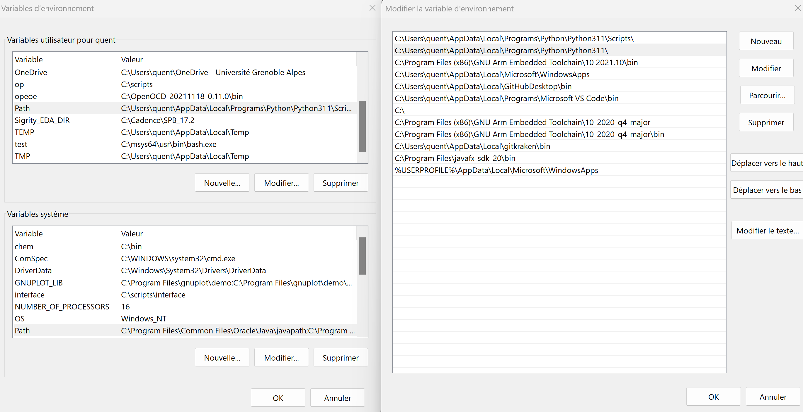

# Tutoriel pour utiliser JLC2KiCad (FR)

## Introduction

JLC2KiCad est un outil développé en **Python** qui permet, à l'aide de la référence JLCPCB, de générer un fichier symbole `.sym`, un fichier empreinte `.mod` et un fichier de modèle 3d `.wrl`. 

## Pré-requis

Afin de pouvoir utiliser JLC2KiCad, il faut au préalable :

1. Posséder une version de Python supérieure à la version 3.6
2. Avoir ajouter Python dans les variables globales Windows

Normalement, Python est présent dans les variables globales car il le propose à l'installation. Si jamais la commande `pip` n'est pas reconnue, c'est que la variable globale est manquante. Pour l'ajouter, se rendre *Propriétés systèmes>Variables d'environnement*. Dans la catégorie *Variables utilisateurs*, celle du dessus, on doit trouver la variable *Path*. Cliquer sur modifier et ajouter le chemin vers l'installation de Python.

## Installation
Pour installer l'application, lancer une invite de commande Windows, et taper `pip install JLC2KiCadLib`. Si l'erreur est que pip n'est pas reconnue, veuillez vous reporter au pré-requis.

## Utilisation

A présent, vous pouvez créer une choisir un dossier dans lequel seront stockées vos fichiers KiCAD. Une fois cela fait, prenez une ou des références de composants JLCPCB. Elle peuvent être trouvées dans le champ **JLCPCB Part #**. Ensuite, exécuter la ligne suivante :

`JLC2KiCadLib -dir CHEMINDUDOSSIER --skip_existing PARTNUMBER`

Avec CHEMINDUDOSSIER le chemin du dossier dans lequel les fichiers seront stockés et PARTNUMBER le/les références de composants JLCPCB. Ils peuvent être mis à la suite avec un espace en guise de séparation.

## Exemple

Je cherche à stocker dans un dossier nommé KICAD sur mon Bureau les fichiers de toute ma liste de composants. La ligne sera la suivante :

`JLC2KiCadLib -dir C:\Users\quent\Desktop\KICAD --skip_existing C176623 C72126 C176571 C2456 C388128 C154950 C263182 C261212 C504197 C433577 C1620142 C723609`

Ce qui me génerera les 3 fichiers (symbole, empreinte et modèle 3d) dans le dossier KICAD pour tout les composants cités.

## Options

Pour certaines raisons, il se peut que vous ne souhaitiez pas certains fichiers.
- `--no footprint` permet de ne pas générer d'empreintes
- `--no symbol` permet de ne pas générer de symboles
- `-symbol_lib SYMBOL_LIB` permet de chosir le nom de la librairie de symbole, en remplaçant SYMBOL_LIB par le nom souhaité
-`-footprint_lib FOOTPRINT_LIB` permet de choisir le nom de la librairie d'empreintes, en remplaçant FOOTPRINT_LIB par le nom souhaité

# Tutorial for using JLC2KiCad (EN)

## Introduction

JLC2KiCad is a **Python** tool which allow you, thanks to the JLCPCB part number, to create a symbol file `.sym`, a footprint file `.mod` and a 3D model file `.wrl`. 

## Prerequisites

In order to use JLC2KiCad, you must first :

1. Have a Python version higher than 3.6
2. Add Python to Windows global variables

Normally, Python is present in the global variables because it is proposed during installation. If the `pip` command is not recognized, the global variable is missing. To add it, go to *System properties>Environment variables*. In the *User variables* category, the one above, you should find the *Path* variable. Click on modify and add the path to the Python installation.

## Installation
To install the application, launch a Windows command prompt, and type `pip install JLC2KiCadLib`. If the error is that pip is not recognized, please refer to the prerequisites.

## Application

Now you can create a folder in which to store your KiCAD files. Once this has been done, select one or more JLCPCB part numbers. These can be found in the **JLCPCB Part #** field. Then execute the following line:

`JLC2KiCadLib -dir REPOPATH --skip_existing PARTNUMBER`

With REPOPATH the path of the folder in which the files will be stored and PARTNUMBER the JLCPCB component reference(s). They can be placed one after the other, separated by a space.

## Example

I want to store the files for my entire list of components in a folder called KICAD on my desktop. The line will be as follows:

`JLC2KiCadLib -dir C:\Users\quent\Desktop\KICAD --skip_existing C176623 C72126 C176571 C2456 C388128 C154950 C263182 C261212 C504197 C433577 C1620142 C723609`

Ce qui me génerera les 3 fichiers (symbole, empreinte et modèle 3d) dans le dossier KICAD pour tout les composants cités.

This will generate the 3 files (symbol, footprint and 3d model) in the KICAD folder for all the components mentioned.

## Options

For certain reasons, you may not wish to generate certain files.
- `--no footprint` allows you not to generate footprints
- `--no symbol` means no symbol generation
- `-symbol_lib SYMBOL_LIB` allows you to select the name of the symbol library, replacing SYMBOL_LIB with the desired name
-`-footprint_lib FOOTPRINT_LIB` selects the name of the footprint library, replacing FOOTPRINT_LIB with the desired name