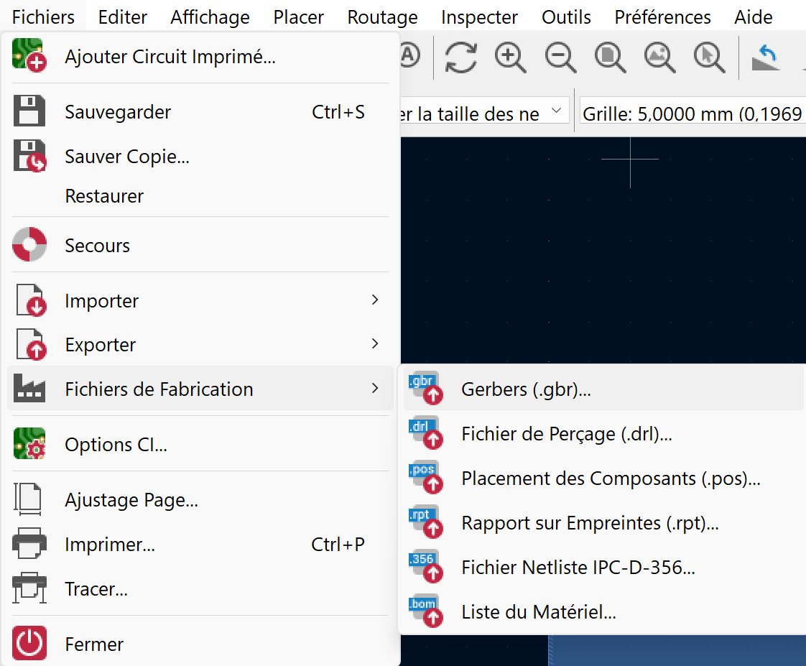
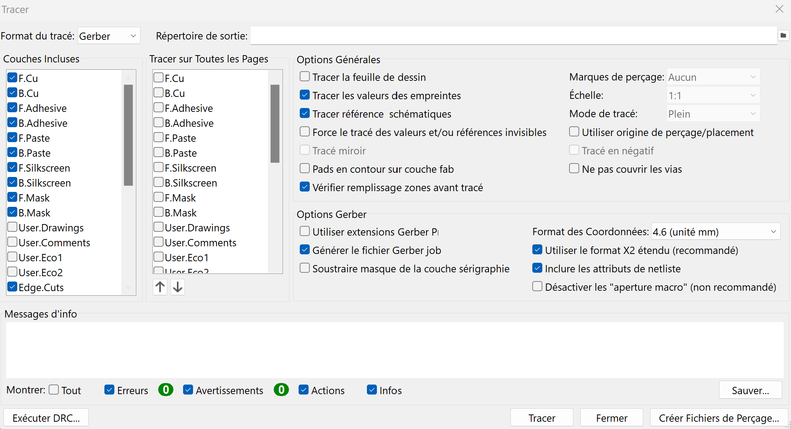
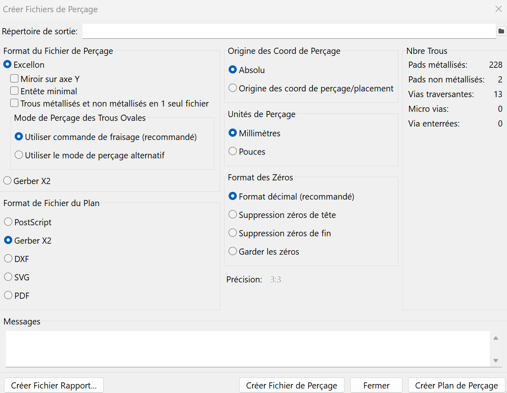
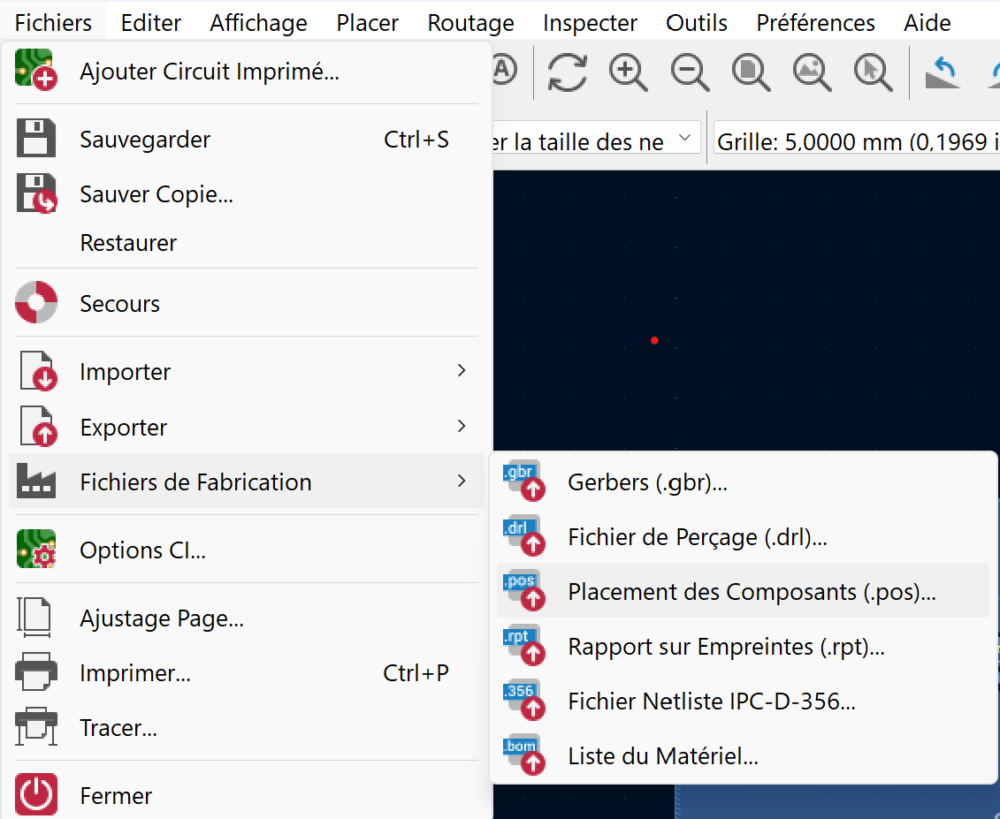
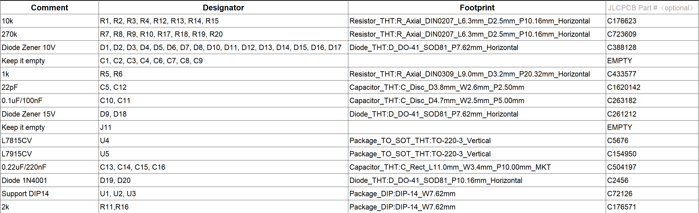
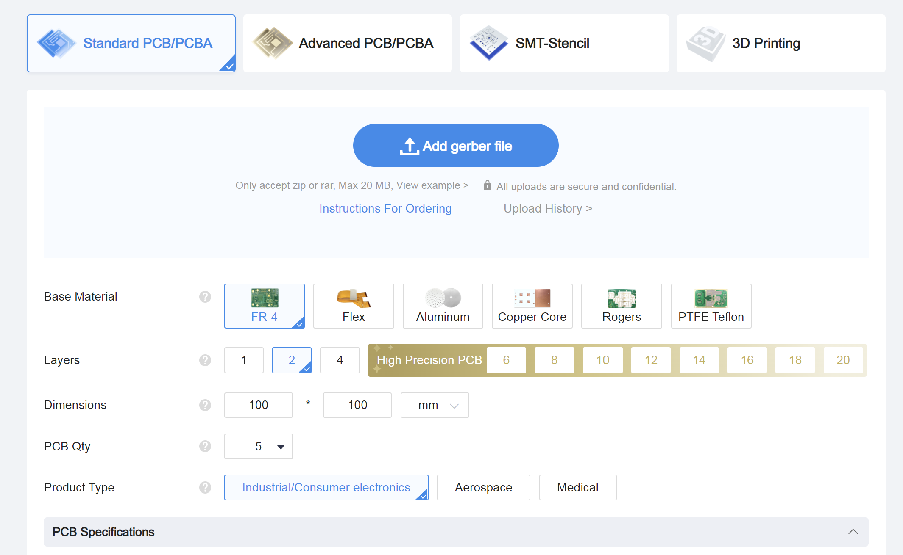

# Tutoriel pour commander sur JLCPCB avec un PCB KiCAD (FR)

## Fichiers KiCAD
### Fichiers de fabrication
Pour fabriquer le PCB sur JLCPCB, il faut créer des fichiers Gerber `.gbr` pour les couches que l'on souhaite créer. Pour se faire, dans l'éditeur de PCB KiCAD, il faut cliquer sur *Fichier>Fichiers de Fabrication>Gerbers* comme sur la figure ci-dessous.

Une fenêtre s'ouvre, sur laquelle on peut notamment choisir les couches à créer. Il faut impérativement conserver les couches 

- F.Cu, c'est la couche cuivre supérieure
- B.Cu, c'est la couche de cuivre inférieure
- F.Silkscreen, c'est la sérigraphie supérieure
- B.Silkscreen, c'est la sérigraphie inférieure
- F.Mask, c'est le masque de soudure supérieur
- B.Mask, c'est la masque de soudure inférieur
- Edge.Cuts, pour avoir les bordures de la carte
  
On peut en soit mettre toutes les couches par sécurité, mais certaines ne sont pas nécessaires comme User.Eco1 par exemple. Il ne faut surtout pas oublier les couches de masque sinon le fabricant ne pourra pas produire la carte

On clique ensuite sur tracer, puis on peut créer les fichiers de perçage par la même occasion (en bas à droite).

Il est recommandé d'utiliser le format Excellon, et le format Gerber X2 comme sur la figure. Cliquer ensuite sur Créer Fichier de Perçage. Une fois tout les fichiers crées, ils apparaîtront dans le répertoire du projet. Il faut maintenant les compresser dans `.zip`.

### Fichiers de position
Il faut ensuite générer un fichier qui indiquera la position de chaque composant. Poiur cela, cliquer sur *Fichier>Fichiers de Fabrication>Placement des Composants*
 

 Il est préférable de générer un fichier pour le **top** et pour le **bottom**, au format `.csv`. Les deux fichiers seront crées dans le répertoire du projet. Il faut à présent les éditer pour changer les entêtes. 
 - *Ref* devient *Designator*
 - *PosX* devient *Mid X*
 - *PosY* devient *Mid Y*
 - *Rot* devient *Rotation*
 - *Side* devient *Layer*

Ces entêtes sont celles qui seront reconnues par le site de JLCPCB. Le fichier par défaut fournit par KiCAD ne sera pas accepté.

### Bill Of Materials (BOM)

Il faut aussi générer ou créer un fichier BOM qui comprendra :
- Un commentaire (la valeur du composant notamment)
- Les références sur le PCB (R1, C2, U6...)
- Le type d'empreinte utilisée
- La référence du composant sur le site JLCPCB (pas obligatoire mais fortement recommandée)

Le fichier BOM devrait ressembler à ça :

Si on veut laisser des emplacements vide sur le PCB, on peut lui indiquer en laissant la ligne vide. J'ai personnellement laisser le fait de laisser vide en commentaire.

## Commande sur le site

Une fois sur le site de JLCPCB, on dépose le dossier `.zip` dans la case de dépôt.

On choisit ensuite plusieurs paramètres tels que le nombre de cartes, l'épaisseur, la couleur...

Je recommande de cocher la case **Confirm production file**. De ce fait, un membre de JLCPCB vous contactera par mail afin que vous confirmiez son fichier de production, pour être sûr.

Je recommande aussi de cocher la case **Confirm Part Placement** dans la partie **PCB Assembly**. Comme il peut y avoir des problèmes entre les empreintes KiCAD et celles sur JLCPCB, il faut mieux être sûr que tout les composants soient bien placés.

On ajoute ensuite le fichier BOM et le CPL. Une fenêtre apparaît ensuite avec la liste des composants selectionnés pour les différentes références. Si jamais le site est en manque de stock sur une référence, il faut chercher une alternative dans leur librairie de composant.

On arrive enfin sur la partie placement des composants. Il y a de gros problèmes de compatibilité entre le placement des composants par KiCAD et JLCPCB. De ce fait, il peut arriver que les composants ne soient pas placés aux endroits prévus. Si c'est le cas, vous pouvez tous les replacer à la main directement sur leur site, sinon voir le tutoriel JLC2KICAD pour mettre à jour vos empreintes.

Une fois que le placement des composants correspond à ce que vous vouliez, vous pouvez confirmer la commande.

# Tutorial for ordering on JLCPCB with a KiCAD PCB (EN)

## KiCAD files
### Manufacturing files
To manufacture the PCB on JLCPCB, you need to create Gerber `.gbr` files for the layers you want to create. To do this, in the KiCAD PCB editor, click on *File>Manufacture Files>Gerbers* as shown in the figure below.

A window opens, where you can select the layers to be created. It is essential to keep the layers 

- F.Cu, the top copper layer
- B.Cu, the bottom copper layer
- F.Silkscreen, the top silkscreen layer
- B.Silkscreen is the lower screen print
- F.Mask, the upper solder mask
- B.Mask, the lower mask
- Edge.Cuts, for the edges of the card
  
You can put in all the layers for safety, but some are not necessary, like User.Eco1 for example. Above all, don't forget the mask layers, otherwise the manufacturer won't be able to produce the card

Then click on draw, and you can create the drilling files at the same time (bottom right).

We recommend using the Excellon format, and the Gerber X2 format as shown in the figure. Then click on Create Drilling File. Once all the files have been created, they will appear in the project directory. They now need to be compressed into `.zip'.

### Position files
Next, you need to generate a file indicating the position of each component. To do this, click on *File>Manufacture Files>Component Positioning*.
 

 It is best to generate a file for the **top** and for the **bottom**, in `.csv` format. The two files will be created in the project directory. You now need to edit them to change the headers. 
 - *Ref* becomes *Designator*.
 - PosX* becomes *Mid X*.
 - PosY* becomes Mid Y*.
 - Rot* becomes Rotation
 - *Side* becomes *Layer*

These headers are the ones that will be recognised by the JLCPCB site. The default file provided by KiCAD will not be accepted.

### Bill Of Materials (BOM)

You also need to generate or create a BOM file which will include :
- A comment (the value of the component in particular)
- PCB references (R1, C2, U6, etc.)
- The type of footprint used
- The component reference on the JLCPCB site (not compulsory but strongly recommended)

The BOM file should look like this:

If you want to leave empty slots on the PCB, you can indicate this by leaving the line empty. I've personally left it blank as a comment.

## Ordering on the site

Once you're on the JLCPCB site, drop the `.zip` folder in the drop box.

You then choose several parameters such as the number of cards, thickness, colour, etc.

I recommend ticking the **Confirm production file** box. This way, a JLCPCB member will contact you by email to confirm their production file, just to be sure.

I also recommend checking the **Confirm Part Placement** box in the **PCB Assembly** section. As there can be problems between the KiCAD footprints and those on JLCPCB, it's best to be sure that all the components are correctly placed.

We then add the BOM file and the CPL. A window then appears with the list of components selected for the different references. If the site is ever out of stock on a part number, you need to look for an alternative in their component library.

Finally, we come to the component placement section. There are major compatibility problems between the placement of components by KiCAD and JLCPCB. As a result, components may not be placed where they should be. If this is the case, you can replace them all by hand directly on their site, otherwise see the JLC2KICAD tutorial to update your footprints.

Once the placement of the components matches what you wanted, you can confirm the order.
